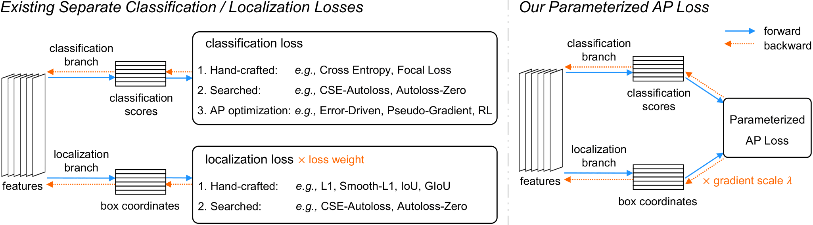
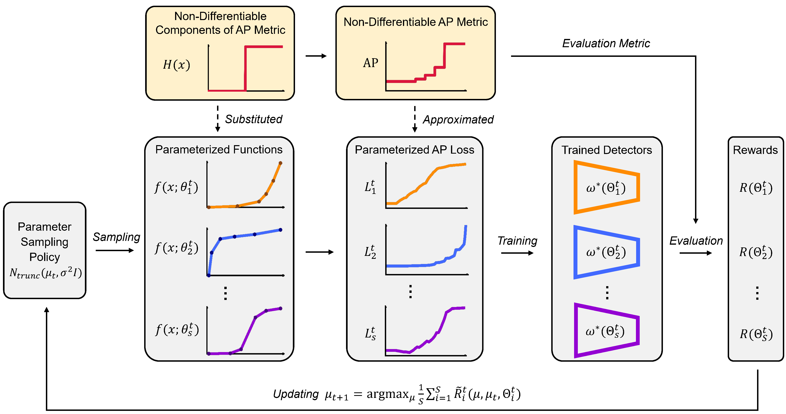

# Parameterized AP Loss

By [Chenxin Tao](https://scholar.google.com/citations?user=sXHFIBkAAAAJ&hl=zh-CN),
[Zizhang Li](https://kyleleey.github.io/),
[Xizhou Zhu](https://scholar.google.com/citations?user=02RXI00AAAAJ),
[Gao Huang](http://www.gaohuang.net/),
[Yong Liu](https://scholar.google.com/citations?user=qYcgBbEAAAAJ),
[Jifeng Dai](https://jifengdai.org/)

This is the official implementation of the Neurips 2021 paper [Searching Parameterized AP Loss for Object Detection](https://openreview.net/pdf?id=hLTZCN7f3M-).  

## Introduction

**TL; DR.** 

Parameterized AP Loss aims to better align the network training and evaluation in object detection. It builds a unified formula for classification and localization tasks via parameterized functions, where the optimal parameters are searched automatically.




**Introduction.** 

* In evaluation of object detectors, Average Precision (AP) captures the performance of localization and classification sub-tasks simultaneously. 

* In training, due to the non-differentiable nature of the AP metric, previous methods adopt separate differentiable losses for the two sub-tasks. Such a mis-alignment issue may well lead to performance degradation.

* Some existing works seek to design surrogate losses for the AP metric manually, which requires expertise and may still be sub-optimal.

* In this paper, we propose Parameterized AP Loss, where parameterized functions are introduced to substitute the non-differentiable components in the AP calculation. Different AP approximations are thus represented by a family of parameterized functions in a unified formula. Automatic parameter search algorithm is then employed to search for the optimal parameters. Extensive experiments on the COCO benchmark demonstrate that the proposed Parameterized AP Loss consistently outperforms existing handcrafted losses.




## Main Results with RetinaNet

| Model | Loss | AP | config|
|:-----:|:---:|:---:|:---:|
|R50+FPN| Focal Loss + L1 | 37.5 |[config](./configs/paploss/focal+L1_retinanet_r50_fpn.py)|
|R50+FPN| Focal Loss + GIoU | 39.2 |[config](./configs/paploss/focal+giou_retinanet_r50_fpn.py)|
|R50+FPN| AP Loss + L1 | 35.4 |[config](./configs/alrp_loss/ap_loss_retinanet_r50_fpn_100e_coco500.py)|
|R50+FPN| aLRP Loss | 39.0 |[config](./configs/alrp_loss/alrp_loss_retinanet_r50_fpn_100e_coco500.py)|
|R50+FPN| Parameterized AP Loss | 40.5 |[search config](./search_configs/cfg_search_retina.py) <br /> [training config](./configs/paploss/paploss_retinanet_r50_fpn.py)|

## Main Results with Faster-RCNN

| Model | Loss | AP | config|
|:-----:|:---:|:---:|:---:|
|R50+FPN| Cross Entropy + L1 | 39.0 |[config](./configs/paploss/CE+L1_fasterrcnn_r50_fpn.py)|
|R50+FPN| Cross Entropy + GIoU | 39.1 |[config](./configs/paploss/CE+giou_fasterrcnn_r50_fpn.py)|
|R50+FPN| aLRP Loss | 40.7 |[config](./configs/alrp_loss/alrp_loss_faster_rcnn_r50_fpn_100e_coco500.py)|
|R50+FPN| AutoLoss-Zero | 39.3 |-|
|R50+FPN| CSE-AutoLoss-A | 40.4 |-|
|R50+FPN| Parameterized AP Loss | 42.0 |[search config](./search_configs/cfg_search_faster_rcnn.py) <br /> [training config](./configs/paploss/paploss_fasterrcnn_r50_fpn.py)|


## Installation

Our implementation is based on [MMDetection](https://github.com/open-mmlab/mmdetection) and [aLRPLoss](https://github.com/kemaloksuz/aLRPLoss), thanks for their codes!

### Requirements
- Linux or macOS
- Python 3.6+
- PyTorch 1.3+
- CUDA 9.2+
- GCC 5+
- mmcv

Recommended configuration: Python 3.7, PyTorch 1.7, CUDA 10.1.

### Install mmdetection with Parameterized AP Loss
a. create a conda virtual environment and activate it.

```bash
conda create -n paploss python=3.7 -y
conda activate paploss
```
  
b. install pytorch and torchvision following [official instructions](https://pytorch.org/).

```bash
conda install pytorch=1.7.0 torchvision=0.8.0 cudatoolkit=10.1 -c pytorch
```
    
c. intall mmcv following [official instruction](https://github.com/open-mmlab/mmcv/tree/master/docs).
We recommend installing the pre-built `mmcv-full`. For example, if your CUDA version is 10.1 and pytorch version is 1.7.0, you could run:

```bash
pip install mmcv-full -f https://download.openmmlab.com/mmcv/dist/cu101/torch1.7.0/index.html
```
    
d. clone the repository.

```bash
git clone https://github.com/fundamentalvision/Parameterized-AP-Loss.git
cd Parameterized-AP-Loss
```

e. Install build requirements and then install mmdetection with Parameterized AP Loss. (We install our forked version of pycocotools via the github repo instead of pypi for better compatibility with our repo.)

```bash
pip install -r requirements/build.txt
pip install -v -e .  # or "python setup.py develop"
```

## Usage

### Dataset preparation

Please follow the [official guide](https://github.com/open-mmlab/mmdetection/blob/master/docs/1_exist_data_model.md) of mmdetection to organize the datasets. Note that we split the original training set into search training and validation sets with this [split tool](https://github.com/akarazniewicz/cocosplit). The recommended data structure is as follows:

```none
Parameterized-AP-Loss
├── mmdet
├── tools
├── configs
└── data
    └── coco
        ├── annotations
        |   ├── search_train2017.json
        |   ├── search_val2017.json
        |   ├── instances_train2017.json
        |   └── instances_val2017.json
        ├── train2017
        ├── val2017
        └── test2017
```

### Searching for Parameterized AP Loss

The search command format is 

```
./tools/dist_search.sh {CONFIG_NAME} {NUM_GPUS}
```

For example, the command for searching for RetinaNet with 8 GPUs is as follows:

```
./tools/dist_search.sh ./search_configs/cfg_search_retina.py 8
```


### Training models with the provided parameters

After searching, copy the optimal parameters into the provided training config. We have also provided a set of parameters searched by us.

The re-training command format is 

```
./tools/dist_train.sh {CONFIG_NAME} {NUM_GPUS}
```

For example, the command for training RetinaNet with 8 GPUs is as follows:

```
./tools/dist_train.sh ./configs/paploss/paploss_retinanet_r50_fpn.py 8
```

## License

This project is released under the [Apache 2.0 license](./LICENSE).

## Citing Parameterzied AP Loss
If you find Parameterized AP Loss useful in your research, please consider citing:
```bibtex
@inproceedings{tao2021searching,
  title={Searching Parameterized AP Loss for Object Detection},
  author={Tao, Chenxin and Li, Zizhang and Zhu, Xizhou and Huang, Gao and Liu, Yong and Dai, Jifeng},
  booktitle={Thirty-Fifth Conference on Neural Information Processing Systems},
  year={2021}
}
```